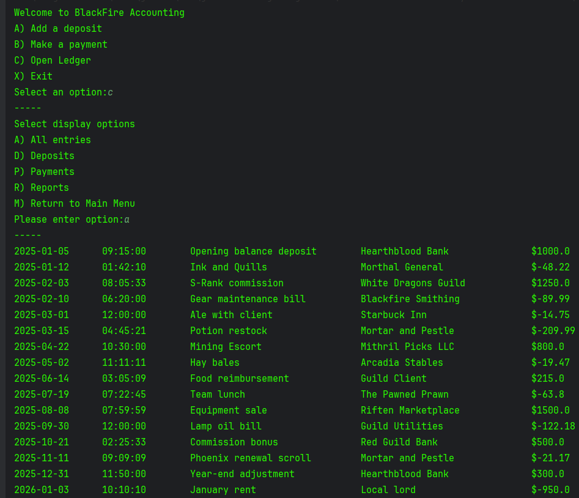

# BlackFire Ledger

## Description
BlackFire Ledger is a simple Java-based console application that allows users to manage basic financial transactions. Users can record deposits, make payments, and view a ledger of all transactions. This project was built to practice file handling, user input, and object-oriented programming in Java.

## Features
- Add deposits with date, time, description, vendor, and amount
- Record payments (automatically stored as negative values)
- View a full transaction ledger
- Sort transactions by date and time
- Filter transactions by date (e.g., previous month)
- Persistent storage using file handling

## How to Run
- Open the project in an IDE like IntelliJ IDEA 
- Locate the Main class
- Run the program

## Example Usage

## Technologies Used
- Java

## Future Improvement Ideas
- Add a GUI
- Implement Advanced search filters

## Author
John Hart